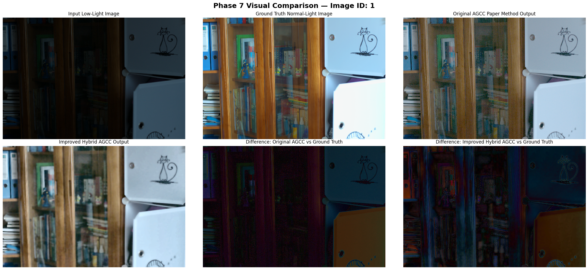

<div align="center">

# AGCC Enhanced Low-Light Image Processing

### Research reproduction, classical image enhancement, and comparative evaluation

[](https://www.python.org/)
[](https://jupyter.org/)
[](LICENSE)

An academic implementation and extension of **Adaptive Gamma and Color Correction (AGCC)** for enhancing low-light images. The repository reproduces the selected 2024 paper, proposes a classical hybrid improvement, and compares both methods using visual and quantitative evaluation.

[Explore the notebooks](#notebooks) · [View results](#sample-result) · [Read the report](Report/Final_Report_AGCC.pdf) · [View presentation](Presentation/AGCC%20Low-Light%20Image%20Enhancement%20-%20Final%20Project%20Presentation.pptx)

</div>

---

## Overview

Low-light images often suffer from poor visibility, weak contrast, color distortion, and amplified noise. This project studies the AGCC method and extends it with additional digital image processing techniques—without relying on deep learning.

The work is organized into three main stages:

1. **Paper reproduction:** implement the original AGCC pipeline.
2. **Proposed improvement:** add classical enhancement and denoising techniques.
3. **Comparative evaluation:** compare the input, original AGCC, improved AGCC, and normal-light reference.

## Processing pipelines

### Original AGCC

```text
Low-light image
      ↓
Adaptive gamma correction
      ↓
RGB mean-based color correction
      ↓
Contrast stretching
      ↓
Enhanced image
```

### Improved hybrid AGCC

```text
Low-light image
      ↓
Original AGCC + bilateral filtering + LAB CLAHE
      ↓
Wavelet denoising + Canny edge detection
      ↓
Morphological refinement + edge-guided sharpening
      ↓
Improved enhanced image
```

## Sample result

The comparison below shows a low-light input, its normal-light reference, the reproduced AGCC output, the proposed hybrid output, and their visual difference maps.



The complete step-by-step pipeline, additional samples, histograms, and metric plots are available in the [`Results`](Results) directory.

## Evaluation summary

The final Phase 7 experiment reports the following averages on the selected LOL dataset subset:

| Metric | Original AGCC | Improved hybrid AGCC | Interpretation |
|---|---:|---:|---|
| PSNR | 16.4673 dB | **17.2236 dB** | Higher is better |
| SSIM | 0.6151 | **0.6833** | Higher is better |
| NIQE | 7.5214 | **5.5877** | Lower is better |
| Entropy | 6.5933 | **7.2032** | Higher generally indicates more information |
| Contrast | 35.3876 | **44.2303** | Higher indicates stronger intensity separation |
| Execution time | **0.0465 s** | 0.1896 s | Lower is faster |

> [!NOTE]
> These values come from this repository's selected dataset subset and experimental setup. They should not be treated as a direct replacement for the paper authors' full benchmark. The improved method performs better on several metrics, while the original method remains faster and performs better on some measurements such as BRISQUE and sharpness.

The source tables are available in [`Data_Tables(CSV + EXCEL FILE)`](Data_Tables%28CSV%20%2B%20EXCEL%20FILE%29).

## Techniques used

| Category | Techniques |
|---|---|
| Brightness enhancement | Adaptive gamma correction |
| Color correction | RGB mean balancing |
| Contrast enhancement | Contrast stretching, CLAHE |
| Noise reduction | Bilateral filtering, wavelet denoising |
| Edge processing | Canny edge detection, morphological refinement |
| Detail enhancement | Edge-guided unsharp masking |
| Evaluation | PSNR, SSIM, NIQE, BRISQUE, entropy, contrast, sharpness |

## Repository structure

```text
.
├── Code/
│   ├── AGCC Core Implementation.py
│   ├── Implementation of Paper and Result Comparsion (Phase 4+ 5).ipynb
│   ├── Improvement in Research Paper (Phase 6 ).ipynb
│   └── Comparsion Orginal Paper vs Improvement (Phase 7).ipynb
├── Data_Tables(CSV + EXCEL FILE)/   # Exported experiment tables
├── Presentation/                    # Final project presentation
├── Report/                          # Final project report
├── Research Paper/                  # Selected source paper
├── Results/                         # Saved figures and comparisons
├── tests/                           # Core-function validation tests
└── requirements.txt                 # Project dependencies
```

## Notebooks

Run the notebooks in this order:

1. **Phase 4 + 5 — Paper implementation and evaluation**
   [`Implementation of Paper and Result Comparsion (Phase 4+ 5).ipynb`](Code/Implementation%20of%20Paper%20and%20Result%20Comparsion%20%28Phase%204%2B%205%29.ipynb)
   Reproduces the original AGCC method and evaluates it using the LOL dataset.

2. **Phase 6 — Proposed hybrid improvement**
   [`Improvement in Research Paper (Phase 6 ).ipynb`](Code/Improvement%20in%20Research%20Paper%20%28Phase%206%20%29.ipynb)
   Adds bilateral filtering, CLAHE, wavelet denoising, edge processing, and selective enhancement.

3. **Phase 7 — Final comparison**
   [`Comparsion Orginal Paper vs Improvement (Phase 7).ipynb`](Code/Comparsion%20Orginal%20Paper%20vs%20Improvement%20%28Phase%207%29.ipynb)
   Compares the original and improved methods using visual outputs and quality metrics.

## Getting started

### Option A: Google Colab (recommended for beginners)

1. Open the notebook you want to run on GitHub.
2. Click **Open in Colab** if the option appears, or go to [Google Colab](https://colab.research.google.com/).
3. Select **File → Open notebook → GitHub**.
4. Paste this repository URL:

   ```text
   https://github.com/mhasnat013/AGCC-Enhanced-Low-Light-Image-Processing
   ```

5. Choose a notebook from the `Code` directory.
6. Run the cells from top to bottom.

Colab is recommended because optional metrics such as NIQE and BRISQUE may require heavier packages and model downloads.

### Option B: Run locally

Prerequisites:

- Python 3.10 or newer
- Git
- Jupyter Notebook or JupyterLab

Clone and enter the repository:

```bash
git clone https://github.com/mhasnat013/AGCC-Enhanced-Low-Light-Image-Processing.git
cd AGCC-Enhanced-Low-Light-Image-Processing
```

Create and activate a virtual environment:

```bash
python -m venv .venv
```

Windows PowerShell:

```powershell
.\.venv\Scripts\Activate.ps1
```

macOS/Linux:

```bash
source .venv/bin/activate
```

Install dependencies and start Jupyter:

```bash
python -m pip install --upgrade pip
pip install -r requirements.txt
jupyter lab
```

> [!TIP]
> If you only want to use the reusable core functions, start with [`Code/AGCC Core Implementation.py`](Code/AGCC%20Core%20Implementation.py). The notebooks contain the complete research experiments and visualizations.

## Using the core implementation

Because the current source filename contains spaces, the simplest beginner-friendly approach is to run it from the `Code` folder or copy the required functions into a notebook.

The main public functions are:

- `original_agcc(image)` — runs the reproduced three-stage AGCC pipeline.
- `improved_hybrid_agcc(image)` — runs the compact hybrid implementation.
- `evaluate_with_reference(output, reference)` — calculates PSNR and SSIM.

Images passed to these functions should be RGB NumPy arrays with shape `(height, width, 3)`.

## Validating the core implementation

After installing the project dependencies, the reusable core functions can be checked locally with:

```bash
python -m py_compile "Code/AGCC Core Implementation.py"
python -m unittest discover -s tests -v
```

The included tests verify input normalization, adaptive gamma calculation, output dimensions and ranges, and PSNR/SSIM evaluation behavior. The full research notebooks are not part of these lightweight tests because they download datasets and optional quality-assessment models.

## Reports and supporting material

- [Final report](Report/Final_Report_AGCC.pdf)
- [Research paper](Research%20Paper/Research_Paper_AGCC_2024.pdf)
- [Final presentation](Presentation/AGCC%20Low-Light%20Image%20Enhancement%20-%20Final%20Project%20Presentation.pptx)
- [CSV and Excel result tables](Data_Tables%28CSV%20%2B%20EXCEL%20FILE%29)
- [Generated visual results](Results)

## Reproducibility notes

- The notebooks use the public `geekyrakshit/LoL-Dataset` mirror on Hugging Face.
- Dataset availability, package versions, and downloaded quality-assessment models can affect results.
- NIQE and BRISQUE are optional in the notebooks; unavailable models are handled without stopping the main experiment.
- Saved results and exported tables are included so the project can still be reviewed without rerunning expensive cells.

## Project team

- **Muhammad Hasnat Fakhar** — [@mhasnat013](https://github.com/mhasnat013)
- **Hassan Sajjad**

This work was completed as a Digital Image Processing semester project under the supervision of **Mr. Yaseen Mushtaq**.

## License

This project is released under the [MIT License](LICENSE). You may use, modify, and distribute the code under its terms. Please retain the copyright and license notice.

## Acknowledgements

- The authors of *Adaptive Gamma and Color Correction for Enhancing Low-Light Images*.
- The creators and maintainers of the LOL dataset and its public mirrors.
- The open-source communities behind Python, OpenCV, scikit-image, PyWavelets, PyTorch, and Jupyter.

---

<div align="center">

If this repository helps your study or research, consider giving it a ⭐.

</div>
